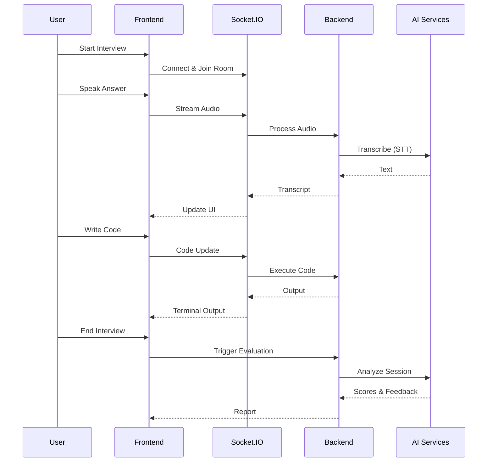

# PrepView - AI-Powered Interview Practice Platform

A production-ready AI interview simulator with real-time voice interaction, live coding environment, and automated evaluation.

## 🌟 Features

### Core Features
- 🏠 **Beautiful Homepage** with smooth scrolling sections
- 🔐 **Authentication** (Login/Signup) with JWT
- 📄 **Enhanced CV Builder** with projects, experience, and live preview
- 📊 **User Dashboard** with interview history and analytics

### AI Interview Platform (NEW)
- 🎤 **Voice Interview** - Real-time speech-to-text and AI-generated questions
- 💻 **Live Coding Environment** - Monaco Editor with terminal integration
- 🤖 **AI Evaluation** - Automated feedback on 7 key metrics
- 📹 **Session Recording** - Full transcript and code snapshot playback
- ⚡ **Real-time Sync** - WebSocket-based live updates

## 🏗️ Tech Stack

### Frontend
- Next.js 14 (App Router)
- TypeScript
- Tailwind CSS
- Monaco Editor (Code editing)
- xterm.js (Terminal emulation)
- Socket.IO Client (Real-time)

### Backend
- Node.js + Express.js
- TypeScript
- Socket.IO (WebSockets)
- Prisma ORM
- SQLite (Dev) / PostgreSQL (Prod)
- JWT Authentication

### AI Services (Mock → Production Ready)
- Speech-to-Text (Mock → OpenAI Whisper)
- Text-to-Speech (Mock → ElevenLabs/Google)
- Code Execution (Safe sandbox)
- AI Evaluation (Mock → GPT-4)

## 🚀 Quick Start

### Prerequisites
- Node.js 18+
- Python 3.x (for code execution)
- Docker (optional)

### Option 1: Run Locally

```bash
# Backend
cd backend
npm install
npx prisma generate
npx prisma db push
npm run dev
# Server: http://localhost:5000

# Frontend (new terminal)
cd frontend
npm install
npm run dev
# App: http://localhost:3000
```

### Option 2: Docker Compose

```bash
docker-compose up
```

## 🧪 Testing

```bash
cd backend
npm test
```

**Test Coverage:**
- ✅ Socket.IO Service (4 tests)
- ✅ Code Execution Service (3 tests)
- ✅ Speech Service (2 tests)
- ✅ Evaluation Service (2 tests)

**Result:** 11 tests passing

## 📁 Project Structure

```
prepview/
├── frontend/              # Next.js application
│   ├── app/              # Pages (App Router)
│   │   ├── page.tsx      # Homepage
│   │   ├── login/        # Authentication
│   │   ├── signup/
│   │   ├── cv-creation/  # CV Builder
│   │   ├── dashboard/    # User Dashboard
│   │   └── interview/    # Interview Interface
│   ├── components/       # React components
│   │   ├── Terminal.tsx  # xterm.js terminal
│   │   ├── CVForm.tsx
│   │   └── ...
│   └── lib/
│       └── socket.ts     # Socket.IO client
│
├── backend/              # Express API
│   ├── src/
│   │   ├── server.ts     # Main server + Socket.IO
│   │   ├── services/     # Business logic
│   │   │   ├── socketService.ts
│   │   │   ├── speechService.ts
│   │   │   ├── codeExecutionService.ts
│   │   │   └── evaluationService.ts
│   │   ├── routes/       # API endpoints
│   │   └── middleware/   # Auth middleware
│   └── prisma/
│       └── schema.prisma # Database schema
│
└── docker-compose.yml    # Container orchestration
```

## 🗄️ Database Schema

### Core Models
- **User** - Authentication and profile
- **CV** - Resume data (JSONB)
- **InterviewSession** - Interview metadata

### AI Platform Models (NEW)
- **Transcript** - Real-time voice transcriptions
- **CodeSnapshot** - Periodic code saves (every 10s)
- **Evaluation** - AI-generated scores and feedback

## 🔌 API Endpoints

### Authentication
- `POST /api/auth/signup` - User registration
- `POST /api/auth/login` - User login

### CV Management
- `GET /api/cv` - Get user's CV
- `POST /api/cv` - Create/update CV

### Interview (NEW)
- `POST /api/interview/start` - Create session
- `POST /api/interview/end` - Trigger evaluation
- `GET /api/interview/:id/report` - Get results

### WebSocket Events
- `join-room` - Join interview session
- `audio-stream` - Send audio data
- `code-update` - Sync code changes
- `terminal-input` - Execute commands

## 🎯 Interview Flow



## 🔧 Configuration

### Backend (.env)
```env
DATABASE_URL="file:./dev.db"
JWT_SECRET="your-secret-key"
PORT=5000
```

### Frontend (.env)
```env
NEXT_PUBLIC_API_URL=http://localhost:5000
```

## 📊 AI Evaluation Metrics

The platform evaluates candidates on:
1. **Clarity** - Communication effectiveness
2. **Understanding** - Problem comprehension
3. **Correctness** - Solution accuracy
4. **Code Quality** - Clean code practices
5. **Test Coverage** - Testing approach
6. **Time Management** - Efficiency
7. **Confidence** - Self-assurance

## 🚧 Roadmap

### Phase 1: MVP (Current)
- ✅ Backend infrastructure
- ✅ Mock AI services
- ✅ Real-time communication
- ✅ Database schema
- ✅ Terminal component
- ⏳ Frontend integration

### Phase 2: Production AI
- [ ] OpenAI Whisper integration
- [ ] GPT-4 evaluation
- [ ] Docker code sandbox
- [ ] Video recording

### Phase 3: Advanced Features
- [ ] Multi-language support
- [ ] Custom question banks
- [ ] Team collaboration
- [ ] Analytics dashboard

## 📚 Documentation

- [Quick Start Guide](./QUICKSTART_AI_PLATFORM.md)
- [Architecture Overview](./ARCHITECTURE.md)
- [API Documentation](./backend/README.md)

## 🤝 Contributing

We follow Test-Driven Development (TDD):
1. Write tests first
2. Implement feature
3. Verify tests pass
4. Refactor

All services have corresponding test files in `__tests__/` directories.

## 📝 License

MIT

## 🙏 Acknowledgments

Built with modern web technologies and AI capabilities to help candidates ace their technical interviews.

---

**Status:** Backend MVP Complete | Frontend Integration In Progress
